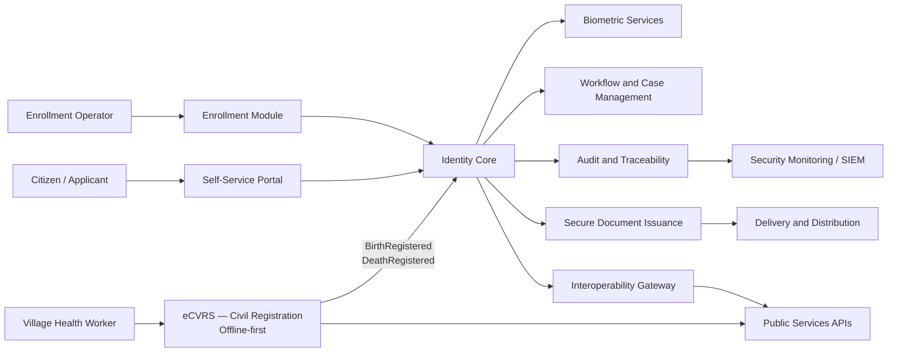

# Digital Identity Architecture Blueprint

> Public portfolio repository by **Mouad SAINDOU** — Engineering Leader focused on Digital Identity, eGovernment, Civil Registration, Critical Systems and .NET platforms.

> **Disclaimer** — This public blueprint formalises the architecture principles I advocate for this type of system: separation of concerns, strong traceability, audit, operational resilience and granular access control. The technical elements presented here reflect architectural practices and principles I defend, not the specifications of any production system.

## 1. Context

This repository is part of a public GitHub portfolio designed to demonstrate architecture thinking, delivery maturity and engineering leadership without exposing private or sensitive systems.

**Repository type:** Architecture Blueprint

## 2. Objectives

Montrer une pensée d’architecture sur une plateforme d’identité numérique / eGovernment sans exposer de code sensible.

Main objectives:

- Present a clean and reusable architecture vision.
- Explain key technical decisions and trade-offs.
- Make security, quality and observability visible from the beginning.
- Provide a professional documentation structure that can evolve over time.

## 3. Architecture overview

## 4. Stack / concepts

- Architecture documentation
- Mermaid / C4 Model
- Security by design
- API-first design
- Offline-first architecture
- CRDT conflict resolution
- Hybrid Logical Clocks
- Event-driven integration (event bus, event sourcing)
- Civil and Vital Registration Systems (eCVRS)
- PKI and device certificate management

## 5. Technical decisions

| Decision | Rationale |
|---|---|
| Keep the repository public but generic | Avoid exposing confidential business logic while demonstrating engineering maturity. |
| Document architecture before implementation | Make intent, constraints and trade-offs explicit. |
| Use ADRs for major decisions | Create a visible decision trail. |
| Treat security as a design concern | Avoid adding security as an afterthought. |
| Include limits and evolution paths | Show realistic thinking rather than artificial perfection. |
| Offline-first by design | African deployment context: connectivity is intermittent or absent; field registration must never depend on a central round-trip. |
| eCVRS as peer system (not module) | Civil registration and national identity have different operational profiles, governance, and data lifecycles. Event bus integration decouples them cleanly. |
| CRDT conflict resolution + human review | No silent automatic merge of civil registration records; ambiguous conflicts surfaced to supervisors to protect data integrity. |
| Ed25519 signatures for offline verification | Compact (64-byte signature), fast verification, no internet dependency; verifier apps cache the public key manifest. |

## 6. Security considerations

- No production secrets, credentials, customer data or private business rules.
- Diagrams and examples are intentionally generic or anonymized.
- Security topics are documented explicitly: identity, access control, audit, traceability, data protection and operational monitoring.

## 7. Quality and governance

This repository follows a lightweight governance model:

- structured README;
- documented decisions in `docs/decisions`;
- clear roadmap;
- review checklist before publication;
- progressive improvements through small commits.

## 8. Limits

This repository is not intended to be a full production system. It is a public architecture and engineering portfolio artifact. Some parts are simplified to keep the content understandable and safe to publish.

## 9. Evolution roadmap

- [x] ADR-0001: public repository scope.
- [x] ADR-0002: identity assurance level strategy.
- [x] ADR-0003: biometric data isolation architecture.
- [x] ADR-0004: eCVRS civil registration integration.
- [x] ADR-0005: offline-first architecture for low-connectivity environments.
- [x] ADR-0006: CRDT sync conflict resolution.
- [x] C4 context diagram (updated with eCVRS and VHW actor).
- [x] C4 container diagram (updated with eCVRS subsystem and event bus).
- [x] Module-level documentation with design concerns.
- [x] Security model: IAM, RBAC+ABAC, data protection, threat model.
- [x] Interoperability: protocols, gateway architecture, API design principles.
- [x] Operational view: SLO/SLI, incident management, backup/recovery.
- [x] eCVRS module: architecture, data model, registration flows, offline operation, security.
- [x] Offline-first design: connectivity tiers, sync engine, SMS fallback, physical transport, offline certificate verification, device PKI, power resilience, chaos testing.
- [x] Sequence diagrams: enrollment, birth registration (offline + connected), death registration, offline certificate verification.
- [ ] ADR-0007: cross-border federation approach (eIDAS 2.0).
- [ ] Sequence diagram: citizen authentication flow (OIDC + step-up).
- [ ] STRIDE threat model for the enrollment flow.
- [ ] STRIDE threat model for the offline sync flow.
- [ ] OpenAPI spec for the identity verification endpoint.
- [ ] Case study or LinkedIn article linking to this repository.

## 10. Related repositories

- `digital-identity-architecture-blueprint`
- `dotnet-critical-systems-template`
- `engineering-leadership-playbook`
- `egov-integration-patterns`
- `observability-zero-trust-lab`
