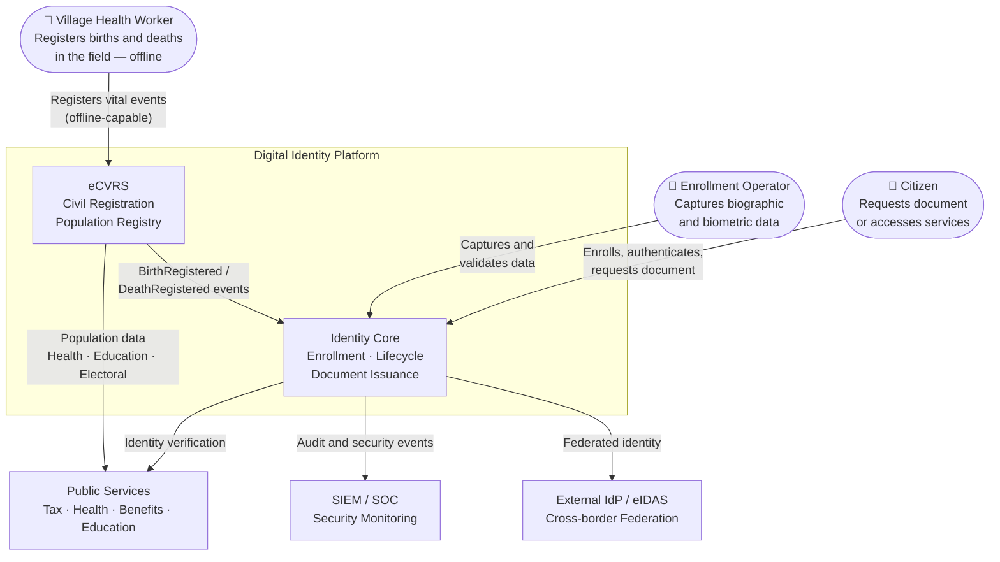

# Context

## Problem domain

Digital identity platforms are critical public infrastructure. They allow citizens and professionals to authenticate, access services, and prove their identity in digital contexts. They intersect legal compliance, security, performance and usability at scale.

Key challenges:

- **Civil registration completeness** — birth certificates are the entry point to legal identity; in many target deployment countries, fewer than 50% of births are registered. The platform must address this gap before national ID enrollment can scale.
- **Enrollment at scale** — capture and validate biographic and biometric data across heterogeneous channels (in-person, online, delegated agents, offline field workers).
- **Identity lifecycle** — issue, update, suspend and revoke identities with full auditability.
- **Interoperability** — integrate with government services, private sector and cross-border identity frameworks.
- **Security and privacy** — protect sensitive personal data under GDPR/data protection law; prevent identity fraud and impersonation.
- **Resilience** — operate as a critical national infrastructure with strict SLA and continuity requirements.
- **Low-connectivity operation** — field registration workers operate in environments with intermittent or absent internet. The system must capture data offline and sync reliably when connectivity is available.

## Stakeholders

| Actor | Role | Concerns |
|---|---|---|
| Citizen | End user | Ease of use, privacy, trust |
| Enrollment Operator | Onsite identity enrollment agent | Process clarity, error handling |
| Village Health Worker | Field civil registration agent | Simple offline-capable tools; works without connectivity |
| District Civil Registrar | Local civil registration authority | Registration completeness; supervisor review queue management |
| Public Service | Identity verification consumer | Reliable identity API; offline certificate verification |
| Security Officer | Governance | Audit trail, access control, incident response |
| System Administrator | Operations | Availability, observability, DR; device fleet management |
| Regulator / DPA | Oversight | Legal compliance, data minimisation |
| Ministry of Interior / Home Affairs | Policy owner | Civil registration law; population statistics |

## Context diagram

## Key quality attributes

| Attribute | Target |
|---|---|
| Availability | 99.9 % (critical services), 99.5 % (non-critical) |
| Response time | < 300 ms p95 for identity verification API |
| Offline capability | Full civil registration operation with zero connectivity; sync when available |
| Sync durability | No event lost regardless of connectivity tier; Tier 0 physical transport is the backstop |
| Data residency | National territory only |
| Auditability | All identity and civil registration operations logged and tamper-evident |
| Privacy | Data minimisation, purpose limitation, right to erasure |
| Certificate verifiability | Certificates verifiable offline with cached public key manifest |

## Constraints

- Must comply with applicable data protection legislation (GDPR or equivalent).
- Biometric data must be stored in isolated, access-controlled vaults.
- No single point of failure for identity issuance or verification flows.
- Full audit trail retained for a defined legal retention period.
- Civil registration field components must operate without connectivity; central confirmation is never a prerequisite for local event capture.
- Field device data must be encrypted at rest; the encryption key must never leave the device TEE.
- Every event must be signed with the originating device's private key before persistence.

## Deployment context

The platform is designed for deployment across heterogeneous infrastructure, including:

- **Tier 3 — Urban / district offices:** 4G / LTE connectivity; standard cloud-native deployment.
- **Tier 2 — Semi-rural:** intermittent 2G/3G coverage; background sync with exponential backoff.
- **Tier 1 — Remote areas:** SMS-only coverage; compact SMS batch protocol for minimum vital fields.
- **Tier 0 — Isolated:** no connectivity; physical USB / SD card data transport to district hub.

Power instability is treated as a primary operational constraint alongside connectivity. Field tablets are expected to operate on battery (minimum 8-hour capacity with solar charging) and all writes are designed to survive power loss at any point in the registration or sync process.

## Assumptions and limits

- This repository contains no real citizen data, no production credentials, and no private business rules.
- Diagrams and examples are generic and anonymized.
- Implementation details are simplified for public readability.
