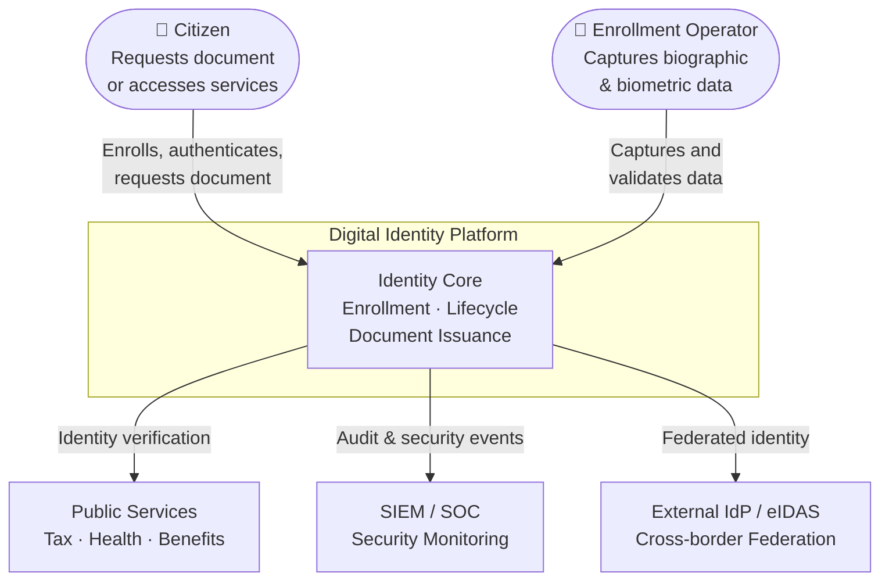

# Context

## Problem domain

Digital identity platforms are critical public infrastructure. They allow citizens and professionals to authenticate, access services, and prove their identity in digital contexts. They intersect legal compliance, security, performance and usability at scale.

Key challenges:

- **Enrollment at scale** — capture and validate biographic and biometric data across heterogeneous channels (in-person, online, delegated agents).
- **Identity lifecycle** — issue, update, suspend and revoke identities with full auditability.
- **Interoperability** — integrate with government services, private sector and cross-border identity frameworks.
- **Security and privacy** — protect sensitive personal data under GDPR/data protection law; prevent identity fraud and impersonation.
- **Resilience** — operate as a critical national infrastructure with strict SLA and continuity requirements.

## Stakeholders

| Actor | Role | Concerns |
|---|---|---|
| Citizen | End user | Ease of use, privacy, trust |
| Enrollment Operator | Onsite agent | Process clarity, error handling |
| Public Service | Consumer | Reliable identity verification API |
| Security Officer | Governance | Audit trail, access control, incident response |
| System Administrator | Operations | Availability, observability, DR |
| Regulator / DPA | Oversight | Legal compliance, data minimisation |

## Context diagram

## Key quality attributes

| Attribute | Target |
|---|---|
| Availability | 99.9 % (critical services), 99.5 % (non-critical) |
| Response time | < 300 ms p95 for identity verification API |
| Data residency | National territory only |
| Auditability | All identity operations logged and tamper-evident |
| Privacy | Data minimisation, purpose limitation, right to erasure |

## Constraints

- Must comply with applicable data protection legislation (GDPR or equivalent).
- Biometric data must be stored in isolated, access-controlled vaults.
- No single point of failure for identity issuance or verification flows.
- Full audit trail retained for a defined legal retention period.

## Assumptions and limits

- This repository contains no real citizen data, no production credentials, and no private business rules.
- Diagrams and examples are generic and anonymized.
- Implementation details are simplified for public readability.
