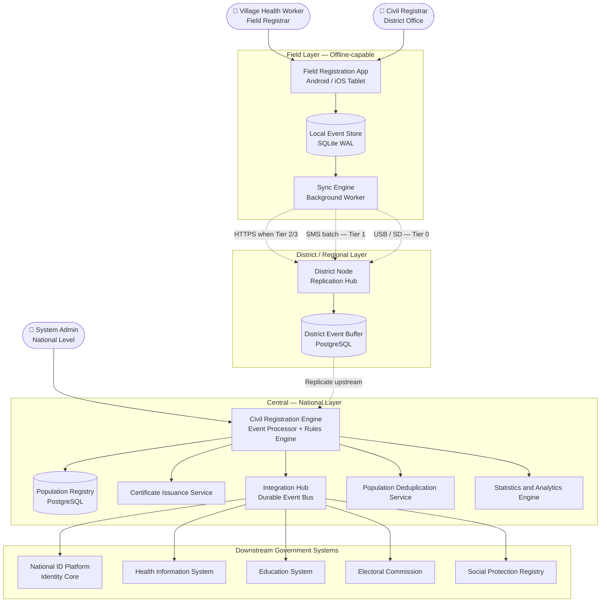
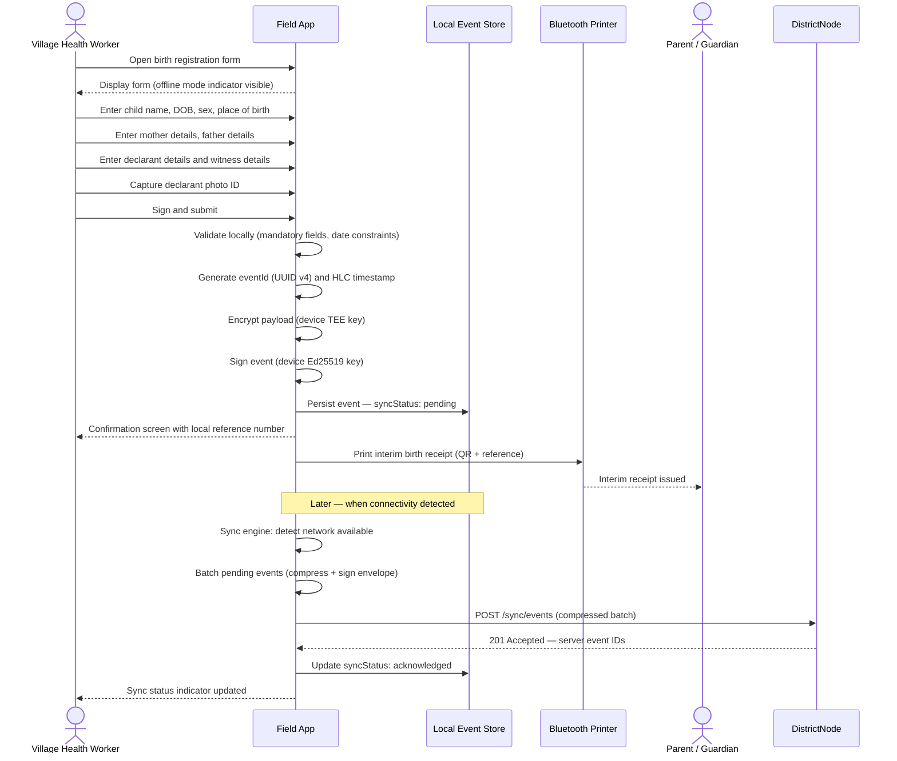
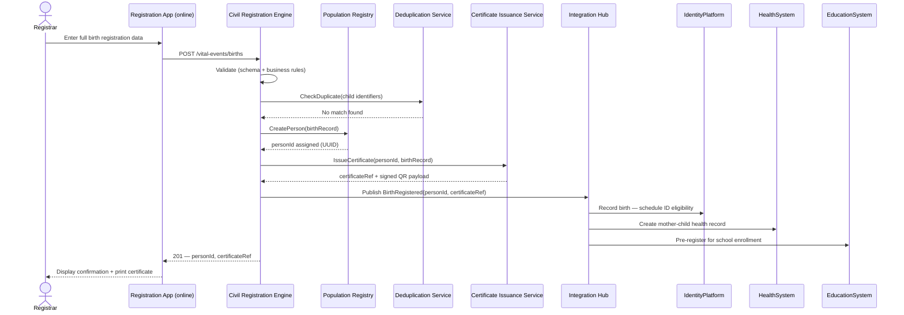
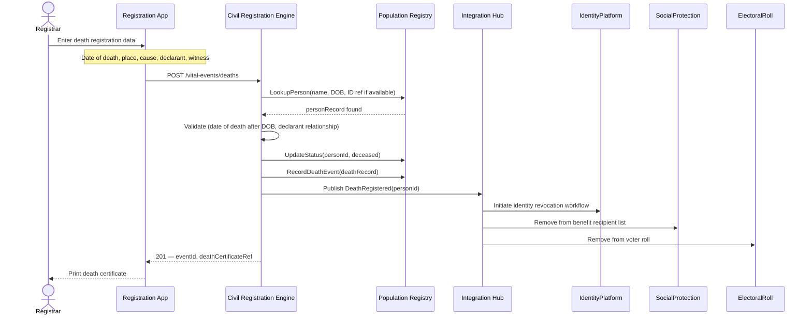
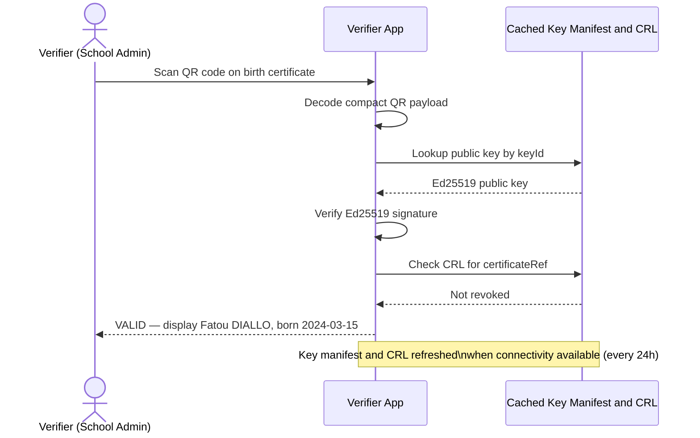

# eCVRS — Electronic Civil and Vital Registration System

## Overview

The Electronic Civil and Vital Registration System (eCVRS) is the **legal foundation of digital identity**. It is the subsystem responsible for recording life events — birth, death, marriage, divorce, adoption — and maintaining an authoritative population registry from which all other identity services derive their data.

In the African context, eCVRS is not a convenience layer: it is the critical intervention point. Approximately **450 million people** in sub-Saharan Africa lack any form of legal identity, primarily because birth registration rates remain below 50% in rural areas. A birth certificate is a citizen's first encounter with the state — without it, access to healthcare, education, social protection, and formal identity documents is legally impossible.

The eCVRS module is designed from the ground up for **low-resource, low-connectivity environments**, with offline-first operation as a first-class architectural requirement. See [offline-first-design.md](offline-first-design.md) for the full offline-first specification.

---

## Scope of vital events

| Event type | Description | Downstream triggers |
|---|---|---|
| **Birth registration** | Legal recording of a live birth | Identity eligibility at legal age; health record creation; school pre-registration |
| **Death registration** | Legal recording of a death | Identity revocation; benefit removal; electoral roll cleanup |
| **Marriage registration** | Legal recording of a civil union | Household update; potential name change |
| **Divorce / dissolution** | Legal recording of union dissolution | Household update |
| **Adoption** | Legal change of parentage and name | Identity update; lineage record amendment |
| **Late registration** | Retrospective registration of past events | Identity baseline for previously unregistered adults |
| **Correction / amendment** | Correction of registration errors with audit trail | Data quality improvement; no overwrite |
| **Nationality acquisition** | Naturalisation or renunciation | Identity status update |

---

## C4 Container diagram — eCVRS subsystem



---

## Connectivity tiers and deployment model

The system operates across four connectivity tiers, each with a different deployment profile and sync mechanism. No tier is treated as a failure state — all tiers are planned operational modes.

| Tier | Connectivity | Sync mechanism | Sync latency |
|---|---|---|---|
| **Tier 0 — Isolated** | None | Physical USB / SD card transport | Days to weeks |
| **Tier 1 — SMS only** | 2G voice/SMS | Compact SMS batch protocol | Hours to days |
| **Tier 2 — Intermittent** | 2G/3G spot coverage | Background HTTPS sync with backoff | Minutes to hours |
| **Tier 3 — Connected** | 4G / LTE / broadband | Real-time HTTPS batch sync | Seconds |

**Design invariant:** the system never assumes a minimum connectivity tier. Every field component handles Tier 0 gracefully. Higher tiers reduce sync latency; they never unlock operations that were unavailable offline.

---

## Component descriptions

### Field Registration App

**Responsibility:** capture vital events on a tablet in the field, with or without internet connectivity.

**Key capabilities:**

- Guided, step-based data entry forms adapted to varying literacy levels.
- Support for multiple local languages (i18n with offline language packs).
- Photo capture for declarant identity document and witnesses.
- Optional biometric capture (fingerprint) where hardware is available.
- Offline operation with local SQLite event store; all writes confirmed locally before any sync.
- Automatic background sync when connectivity is detected.
- Signed receipts printed locally via Bluetooth thermal printer for the declarant.
- PIN-protected device authentication bound to the registered field officer's identity.

**Design concerns:**

- Every form submission is persisted to the local event store before the UI displays confirmation. The registrar always receives an immediate local confirmation regardless of network state.
- Events are signed with the device's private key (provisioned at device setup via PKI ceremony). The signature allows the central system to detect post-capture tampering.
- The app maintains a transparent sync dashboard: pending, uploaded, acknowledged counts per session and per week.

---

### Local Event Store

**Responsibility:** persist all captured vital events durably and with integrity on the device.

**Technology:** SQLite in WAL (Write-Ahead Log) mode.

**Schema:**

```sql
CREATE TABLE events (
    event_id        TEXT PRIMARY KEY,    -- UUID v4, client-generated
    device_id       TEXT NOT NULL,       -- Provisioned device UUID
    event_type      TEXT NOT NULL,       -- birth | death | marriage | correction | ...
    captured_at     TEXT NOT NULL,       -- HLC timestamp: wall_ms:logical:node
    payload_enc     BLOB NOT NULL,       -- AES-256-GCM encrypted payload
    payload_iv      BLOB NOT NULL,       -- Encryption IV
    signature       BLOB NOT NULL,       -- Ed25519 over (event_id|device_id|event_type|captured_at|payload_enc)
    sync_status     TEXT NOT NULL DEFAULT 'pending', -- pending | uploaded | acknowledged
    sync_attempts   INTEGER NOT NULL DEFAULT 0,
    last_attempt_at TEXT,
    ack_server_id   TEXT,                -- Server-side event ID after acknowledgment
    ack_at          TEXT
);

CREATE INDEX idx_events_sync   ON events(sync_status, captured_at);
CREATE INDEX idx_events_device ON events(device_id, captured_at);
```

**Integrity:** a local Merkle root is computed over ordered event IDs and sent with each sync batch. The server uses this to detect gaps or tampering in the device's event set.

**Encryption:** payload is encrypted with AES-256-GCM using a per-device key stored in the device TEE (Android Keystore / iOS Secure Enclave). The key never leaves the TEE. Device wipe destroys the key; events become unrecoverable — by design, to protect citizen data if a device is lost or stolen.

---

### Sync Engine

**Responsibility:** transfer locally persisted events to the district node reliably and efficiently, using whatever connectivity is available.

**Design:**

- Runs as a background service; never blocks the registration UI.
- Detects connectivity tier on start and after every network state change.
- Sends events in compressed batches (default: 50 events per batch, target < 64 KB).
- Applies exponential backoff on failure: `min(60s × 2^n + jitter(0..30s), 3600s)`.
- Marks events as `acknowledged` only after receiving a signed server confirmation — not on upload.
- Supports delta sync: on reconnect, sends only events newer than the server's last acknowledged HLC.
- Supports resume of interrupted batches (uploads are idempotent via client event_id).

See [offline-first-design.md](offline-first-design.md) for the full sync protocol, SMS fallback, and physical transport specifications.

---

### Civil Registration Engine

**Responsibility:** process incoming vital events, validate business rules, update the population registry, detect duplicates, and trigger downstream integrations.

**Key operations:**

| Operation | Description |
|---|---|
| `RegisterBirth` | Validate, deduplicate, assign personId, create population registry record |
| `RegisterDeath` | Validate, link to existing person, update status, trigger revocation chain |
| `RegisterMarriage` | Validate parties, create union record, update household |
| `RegisterDivorce` | Validate union reference, dissolve, update household |
| `ProcessCorrection` | Amend with full audit trail; original record retained |
| `ProcessLateRegistration` | Retrospective registration with elevated validation and supervisor review |

**Design concerns:**

- Idempotent processing: each event carries a client-generated `eventId`. Re-delivery of the same event is a no-op (deduplication on `eventId`).
- Events that fail validation are quarantined in a supervisor review queue — never silently dropped.
- Business rules engine is externally configurable (country-specific rules: declaration window, mandatory fields, witness requirements).

---

### Population Registry

**Responsibility:** maintain the authoritative record of all persons and their vital events.

**Key entities:**

```
Person
  id              : UUID           — national identifier, assigned at birth registration, immutable
  givenName       : string
  familyName      : string
  dateOfBirth     : date
  placeOfBirth    : GeoReference
  sex             : enum
  nationality     : string
  status          : enum           — living | deceased | unknown
  registrationDate: date
  registrationOffice: OfficeRef

VitalEvent
  id              : UUID
  type            : enum           — birth | death | marriage | divorce | adoption | correction
  personId        : UUID
  relatedPersonIds: UUID[]
  registeredAt    : datetime       — HLC timestamp from originating device
  registeredBy    : RegistrarRef
  registrationOffice: OfficeRef
  deviceId        : UUID
  signature       : bytes          — device Ed25519 signature
  serverReceivedAt: datetime

Household
  id              : UUID
  headOfHousehold : UUID
  members         : UUID[]
  address         : GeoReference

RegistrationOffice
  id              : UUID
  level           : enum           — village | district | provincial | national
  jurisdiction    : GeoReference
  parentOfficeId  : UUID
```

**Data retention:** vital records are retained permanently. They are legal documents of record; no expiry or erasure applies (unlike operational identity data subject to GDPR-equivalent rights).

---

### Certificate Issuance Service

**Responsibility:** generate birth, death, and marriage certificates in physical and digital formats.

**Physical certificates:**

- PDF with security features: unique reference number, QR code, official seal, sequential serial.
- Formal certificate: sent to secure print facility (embossed paper, holograms, security ink).
- Field interim receipt: simplified A4 printed via Bluetooth thermal printer as a temporary document pending formal certificate delivery.

**Digital certificates (offline-verifiable):**

- W3C Verifiable Credential issued to the citizen's digital wallet (where available).
- Offline-verifiable QR code: Ed25519 signature over core fields, compact binary encoding (~300 bytes, fits QR version ≤ 20).
- Public keys distributed via a signed key manifest cached in verifier applications.
- Certificate Revocation List (CRL) distributed alongside the key manifest for offline revocation checks.

**Key rotation:** signing keys rotate every 90 days with a 30-day overlap period. Old keys are retained in the manifest for the duration of the overlap to allow verification of recently issued certificates.

---

### Integration Hub

**Responsibility:** propagate civil registration events to downstream government systems in a reliable, decoupled manner.

**Integration patterns:**

- **Event-driven (primary):** vital events published to a durable topic. Downstream systems subscribe to relevant event types. Guaranteed delivery with at-least-once semantics.
- **API-driven (query):** downstream systems query the Population Registry via a controlled read-only API for on-demand lookups.
- **Batch export (legacy):** periodic signed exports for systems that cannot consume events in real time (e.g., legacy electoral roll systems with scheduled import jobs).

**Downstream integration matrix:**

| Downstream system | Trigger event | Action |
|---|---|---|
| National ID Platform | `BirthRegistered` | Record birth certificate link; schedule ID enrollment notification at legal age |
| National ID Platform | `DeathRegistered` | Initiate identity revocation workflow |
| National ID Platform | `MarriageRegistered` | Trigger name change workflow if applicable |
| Health Information System | `BirthRegistered` | Create mother-child health record; initiate vaccination schedule |
| Education System | `BirthRegistered` | Pre-register child for school enrollment at school age |
| Electoral Commission | `BirthRegistered` | Pre-register for voter roll at legal voting age |
| Social Protection Registry | `BirthRegistered` | Check household eligibility for child benefit programs |
| Social Protection Registry | `DeathRegistered` | Remove deceased from benefit recipient list |
| Electoral Commission | `DeathRegistered` | Remove from voter roll |

---

### Population Deduplication Service

**Responsibility:** detect duplicate person records created by multiple registrations of the same individual.

**Design:**

- Runs asynchronously after registration; does not block certificate issuance.
- Probabilistic matching on: name + date of birth + place of birth using phonetic algorithms adapted for local language naming patterns.
- Biometric matching (fingerprint) where capture was performed during registration.
- Suspected duplicates are queued for district supervisor review — no automatic merge.
- Confirmed duplicates: one record marked canonical; the other linked as alias with full audit trail.
- Match decisions are logged and feed back into the matching model over time.

---

## Registration flows

### Birth registration — offline field flow



### Birth registration — connected flow (district office)



### Death registration flow



---

## Offline document verification

Certificates issued by the eCVRS must be verifiable in the field — by a health worker, school administrator, or police officer — without internet access.

### Cryptographic approach

Each certificate QR code encodes a compact signed payload:

```json
{
  "personId": "c7f3-...",
  "fullName": "Fatou DIALLO",
  "dateOfBirth": "2024-03-15",
  "sex": "F",
  "placeOfBirth": "Tambacounda",
  "eventType": "birth",
  "registeredAt": "2024-03-18",
  "registrationOffice": "TAMB-001",
  "certificateRef": "SN-2024-TAMB-000142",
  "keyId": "gov-ecvrs-key-2024-01"
}
```

Signature: `Ed25519.sign(privateKey, SHA-256(canonicalized_JSON))`. The signature is appended to the QR payload in compact binary form.

### Verification sequence



---

## Data quality and completeness

Civil registration data quality is a known governance challenge, particularly in rural contexts.

| Challenge | Manifestation | Mitigation strategy |
|---|---|---|
| **Completeness** | Home births not reported; deaths not declared | Community health worker outreach; periodic registration campaigns |
| **Accuracy** | Approximate dates (year only); spelling inconsistencies | Guided forms with validation; mandatory declarant + witness |
| **Timeliness** | Registrations months or years after the event | Late registration workflow with elevated supervisor review |
| **Language** | Names in local scripts; inconsistent transliteration | Multilingual UI; canonical Latin + local script dual fields |
| **Duplicates** | Multiple registrations across districts | Probabilistic deduplication + biometric matching |

---

## Security considerations specific to eCVRS

| Threat | Control |
|---|---|
| **Field device theft** | PIN-protected device; AES-256 encrypted local store; remote wipe on loss report; certificate revocation |
| **Fraudulent registration** | Declarant photo ID capture; witness requirement; supervisor review for high-risk patterns |
| **Retroactive tampering** | Event log is append-only; corrections create amendment records, never overwrites |
| **Deduplication evasion** | Probabilistic + biometric matching; supervisor review queue |
| **Registrar impersonation** | PKI certificate bound to named registrar + device serial; certificate revoked on reassignment |
| **Fraudulent sync injection** | All events signed with device key; signature validated by server before processing |
| **Data exfiltration** | Field device holds only pending-sync events; no bulk query API; encrypted storage |

---

## Integration with the National Identity Platform

The eCVRS and the National Identity Platform are peer systems connected by a durable event bus and a shared population identifier. See [ADR-0004](decisions/ADR-0004-ecvrs-civil-registration-integration.md) for the full decision record.

### Birth → Identity chain

```
Birth registered in eCVRS
  → personId assigned in Population Registry
  → BirthRegistered event published on event bus
    → Identity Platform consumes event
    → Records birth certificate reference on citizen record
    → Schedules ID enrollment eligibility notification at legal age
    → On reaching legal age: notifies citizen to initiate enrollment
```

### Death → Revocation chain

```
Death registered in eCVRS
  → Person status = deceased in Population Registry
  → DeathRegistered event published on event bus
    → Identity Platform consumes event
    → Opens identity revocation workflow
    → Suspends identity (grace period for estate / probate)
    → Revokes identity → cancels active documents
    → Publishes IdentityRevoked event for downstream cleanup
```

### Shared identifier

The `personId` assigned by the Population Registry at birth registration is the **stable national identifier** shared across all government systems. It is:

- Assigned once at first registration.
- Never reused, never recycled.
- Encoded in the birth certificate QR code.
- Propagated to all downstream systems via the `BirthRegistered` event.
- Used by the Identity Platform as the citizen's stable reference across their entire lifecycle.
