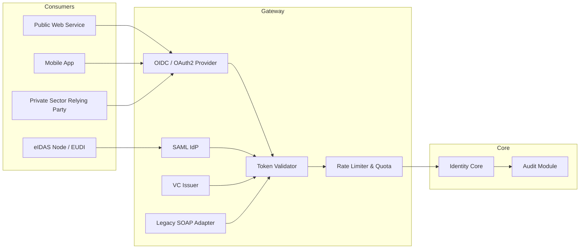

# Interoperability

## Design intent

The identity platform must integrate cleanly with a heterogeneous ecosystem: public service APIs, private sector relying parties, and cross-border identity frameworks. Interoperability is exposed through a dedicated **Interoperability Gateway** that decouples internal implementation from external contracts.

---

## Supported protocols and standards

| Protocol / Standard | Use case |
|---|---|
| OpenID Connect 1.0 | Citizen authentication for web and mobile services |
| OAuth 2.0 (RFC 6749) | Delegated authorization for API consumers |
| SAML 2.0 | Legacy federation with public sector partners |
| eIDAS 2.0 / EUDI Wallet | Cross-border European digital identity |
| ISO 18013-5 (mDL) | Mobile driving licence and proximity presentation |
| W3C Verifiable Credentials | Decentralised identity credentials |
| REST / JSON | Primary API style for new integrations |
| SOAP / WS-Security | Legacy integration with existing government systems |

---

## Interoperability Gateway architecture

---

## Key integration patterns

### Attribute release policy

Only the minimum set of identity attributes required by a relying party is released (data minimisation). Attribute release is governed by a policy matrix per service and per assurance level.

### Consent management

For services that require explicit citizen consent, the platform provides a consent screen and stores consent records with timestamp, scope, and relying party reference.

### Assurance levels

| Level | Description | Typical use |
|---|---|---|
| Low (LoA 1) | Self-asserted, email verified | Informational services |
| Substantial (LoA 2) | Remote identity proofing + MFA | Most citizen services |
| High (LoA 3) | In-person + biometric verification | Legal acts, critical services |

### Error handling and fault isolation

- Downstream service failure does not degrade core identity verification.
- Timeouts, circuit breakers and fallback responses are defined per integration.
- All external calls are logged with correlation IDs for cross-system tracing.

---

## API design principles

- **API-first**: contracts defined as OpenAPI 3.1 specifications before implementation.
- **Versioning**: URI versioning (`/v1/`, `/v2/`) with a defined deprecation policy.
- **Idempotency**: mutating operations accept an `Idempotency-Key` header.
- **Pagination**: cursor-based pagination for list endpoints.
- **Security**: all endpoints require a valid bearer token with appropriate scope; mTLS for service-to-service.

---

## Evolution path

- [ ] Publish OpenAPI spec for the identity verification endpoint.
- [ ] Add W3C VC issuance flow diagram.
- [ ] Document eIDAS 2.0 / EUDI Wallet integration flow.
- [ ] Define SLA and degraded mode for each external dependency.
