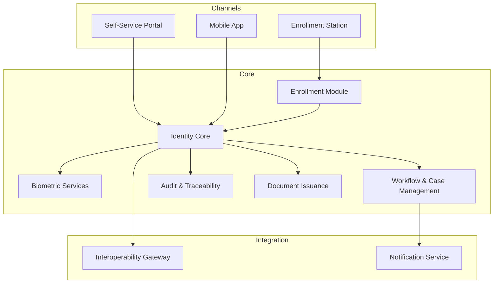

# Modules

## C4 Container diagram

The container diagram shows the major deployable units of the platform, their responsibilities and their relationships.

```mermaid
C4Container
    title Container Diagram — Digital Identity Platform

    Person(citizen, "Citizen", "Accesses portal, requests documents")
    Person(operator, "Enrollment Operator", "Captures biographic and biometric data")
    Person(admin, "System Administrator", "Manages platform configuration and incidents")

    System_Boundary(idp, "Digital Identity Platform") {
        Container(portal, "Self-Service Portal", "React SPA / HTTPS", "Citizen-facing web interface")
        Container(enrollStation, "Enrollment Station App", ".NET / WPF or web", "Operator-assisted data capture")
        Container(apiGateway, "API Gateway", "NGINX / Kong", "Rate limiting, auth enforcement, routing")
        Container(identityApi, "Identity API", "ASP.NET Core / .NET 9", "Commands and queries for identity lifecycle")
        Container(workflowSvc, "Workflow Service", "ASP.NET Core", "Case management and approval orchestration")
        Container(issuanceSvc, "Document Issuance Service", "ASP.NET Core", "Generates digital and physical document orders")
        Container(notificationSvc, "Notification Service", "ASP.NET Core", "Email, SMS and push notifications")
        Container(biometricVault, "Biometric Vault", "ASP.NET Core (isolated)", "Template storage, 1:1 verify, 1:N dedup")
        Container(auditStore, "Audit Store", "Append-only PostgreSQL schema", "Tamper-evident operation log")
        ContainerDb(identityDb, "Identity Database", "PostgreSQL 16", "Identity records, outbox, workflow state")
        ContainerDb(biometricDb, "Biometric Database", "PostgreSQL 16 (isolated)", "Encrypted biometric templates")
        ContainerDb(cache, "Cache", "Redis 7", "Session data, idempotency keys, rate limit counters")
        Container(obsStack, "Observability Stack", "OpenTelemetry / Grafana / Prometheus / Loki", "Logs, metrics, traces")
        Container(interopGw, "Interoperability Gateway", "ASP.NET Core", "OIDC/SAML/VC provider for external consumers")
    }

    System_Ext(govServices, "Public Services", "Tax, health, benefits APIs")
    System_Ext(siem, "SIEM / SOC", "Security monitoring")
    System_Ext(printFacility, "Secure Print Facility", "Physical document personalisation")
    System_Ext(eidasNode, "eIDAS Node / EUDI Wallet", "Cross-border identity federation")

    Rel(citizen, portal, "Uses", "HTTPS")
    Rel(operator, enrollStation, "Uses", "HTTPS")
    Rel(admin, apiGateway, "Manages via admin API", "HTTPS + MFA")

    Rel(portal, apiGateway, "API calls", "HTTPS")
    Rel(enrollStation, apiGateway, "API calls", "HTTPS + mTLS")
    Rel(apiGateway, identityApi, "Routes requests", "HTTP / internal")
    Rel(apiGateway, interopGw, "Routes OIDC/SAML", "HTTP / internal")

    Rel(identityApi, identityDb, "Reads / writes", "TCP")
    Rel(identityApi, cache, "Cache reads/writes", "TCP")
    Rel(identityApi, biometricVault, "Enroll / verify", "mTLS")
    Rel(identityApi, workflowSvc, "Triggers workflow", "async / outbox")
    Rel(identityApi, auditStore, "Writes audit events", "TCP / outbox")
    Rel(identityApi, obsStack, "Logs, metrics, traces", "OTLP")

    Rel(workflowSvc, identityDb, "Reads / writes workflow state", "TCP")
    Rel(workflowSvc, issuanceSvc, "Triggers issuance on approval", "async")
    Rel(workflowSvc, notificationSvc, "Sends notifications", "async")

    Rel(biometricVault, biometricDb, "Encrypted templates", "TCP")
    Rel(issuanceSvc, printFacility, "Sends personalisation data", "HTTPS")

    Rel(interopGw, govServices, "Provides identity verification", "HTTPS")
    Rel(interopGw, eidasNode, "Cross-border federation", "HTTPS / SAML")

    Rel(auditStore, siem, "Streams events", "Syslog / TCP")
```

---

## Module overview

---

## Enrollment Module

**Responsibility:** Capture, validate and submit identity data for a new enrollment request.

**Key flows:**

- Operator-assisted capture (in-person): biographic data entry + biometric capture (fingerprint, face, iris).
- Online pre-enrollment: citizen submits supporting documents and personal data; operator validates in person.

**Design concerns:**

- Idempotent submission — prevent duplicate enrollment for the same identity.
- Step-based workflow with explicit state machine (started → pending validation → approved / rejected).
- Offline-capable enrollment stations with sync-on-reconnect.

---

## Identity Core

**Responsibility:** Maintain the authoritative identity record, its lifecycle and its relationships.

**Key entities:**

- `Identity` — unique citizen record with stable national identifier.
- `IdentityStatus` — active, suspended, revoked, deceased.
- `BiographicData` — civil registry attributes.
- `BiometricReference` — tokenized reference (never stored in clear).

**Key operations:**

- Create / update / suspend / revoke identity.
- Deduplicate against existing records (biographic + biometric matching).
- Emit domain events on status change (for audit and downstream integration).

---

## Biometric Services

**Responsibility:** Biometric capture quality check, template extraction and 1:1 verification / 1:N deduplication.

**Design concerns:**

- Strict separation: biometric vault is isolated from the rest of the system.
- Biometric data is never returned raw; only match score and decision are exposed.
- SDK integration abstracted behind an interface to allow algorithm provider replacement.

---

## Workflow & Case Management

**Responsibility:** Orchestrate multi-step enrollment and issuance processes with human approval gates.

**Patterns used:**

- State machine per case type (enrollment, renewal, correction, revocation).
- Task assignment to operators with SLA tracking.
- Escalation rules when SLA is breached.

---

## Audit & Traceability

**Responsibility:** Record all sensitive operations in a tamper-evident, queryable audit log.

**Design concerns:**

- Write-only append log; no update or delete operations allowed.
- Each event includes: timestamp, actor, operation, entity reference, outcome, correlation ID.
- Supports legal retention policies and regulatory export.

---

## Document Issuance

**Responsibility:** Generate and deliver identity documents (ID card, passport, digital credential) upon workflow approval.

**Key flows:**

- Physical document: generate personalization data → send to secure print facility → track delivery.
- Digital credential: generate W3C Verifiable Credential or mobile driving licence (ISO 18013-5).

---

## Interoperability Gateway

**Responsibility:** Expose identity verification capabilities to authorized external consumers.

See [interoperability.md](interoperability.md) for details.
