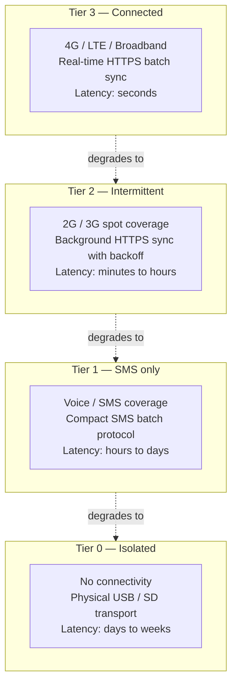
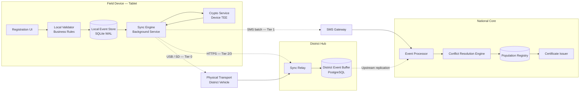
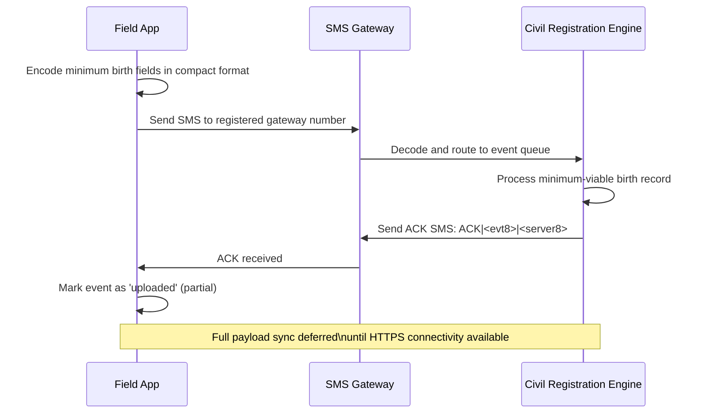
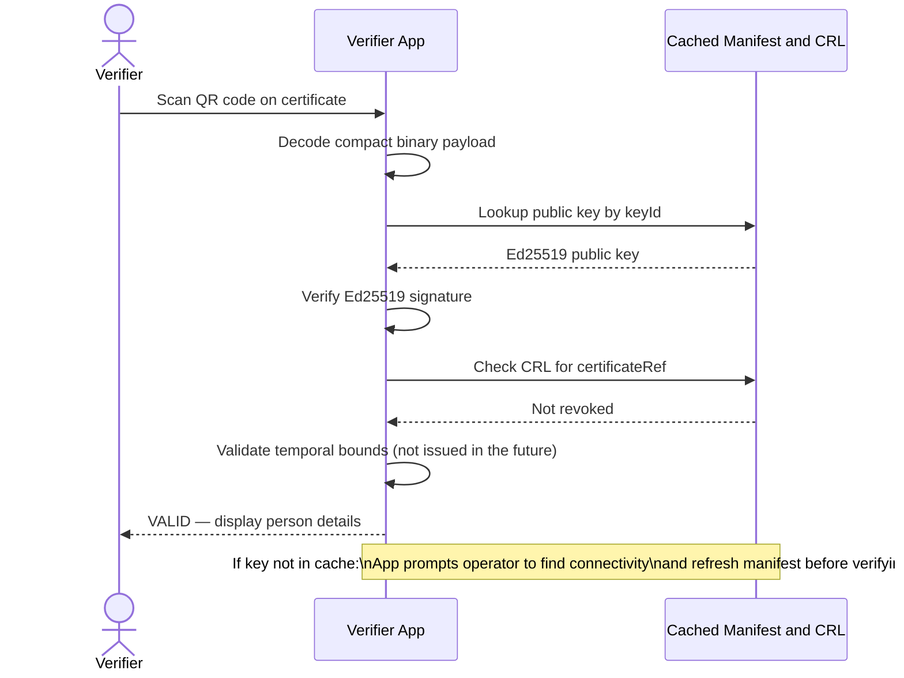

# Offline-First Architecture — Low-Connectivity Deployment

## The connectivity challenge

The digital identity and civil registration infrastructure is deployed across environments that range from fully connected urban data centres to remote rural villages with no power grid and no internet access. Any architecture that treats connectivity as a baseline assumption systematically excludes the citizens who need these services most.

Key empirical realities for sub-Saharan Africa (ITU, GSMA, World Bank, 2024):

| Indicator | Reality |
|---|---|
| Internet penetration | ~36% of population; predominantly mobile |
| Rural internet access | < 10% in many countries |
| 4G+ coverage | Available to ~60% of the population, actively used by ~30% |
| 2G voice / SMS coverage | ~85% of inhabited territory |
| Power grid reliability | Frequent outages; rural electrification incomplete in most countries |
| Mobile data cost | 2–10% of monthly income per 1 GB (prohibitive for daily sync) |

This is not a transitional state. It represents the operational reality for the majority of field registration workers for at least the next decade. The architecture must treat these conditions as the primary scenario, not edge cases.

---

## Design philosophy

> **Offline is the default. Connectivity is an optimisation.**

Every operation that can be completed offline must be completed offline. A field registrar capturing a birth in a remote village must be able to:

1. Open the application — no network call.
2. Complete the full registration form — local validation only.
3. Sign and submit the registration — persisted locally immediately.
4. Issue a physical interim receipt to the parent — local print.
5. See exactly which events are pending, uploaded, and acknowledged — local sync log.

All of this must work with zero network connectivity, for as long as necessary — hours, days, or weeks.

This principle cascades across every layer:

| Layer | Offline-first principle |
|---|---|
| Field app | No network dependency for rendering, validation, or confirmation |
| Local event store | All writes persisted locally before any sync attempt |
| District hub | Operates independently if national layer is unreachable |
| Certificate verification | Verifiable offline with cached public keys |
| National event processor | Accepts delayed, batched events without rejection |

---

## Connectivity tiers

Four operational tiers define the sync strategy available at any given moment. Components detect their current tier automatically and degrade gracefully.



**Design invariant:** the system never requires a minimum tier. Every field component handles Tier 0 gracefully. Higher tiers improve sync speed; they do not unlock operations that were unavailable offline.

---

## Architecture overview



---

## Local event store

The local event store is the cornerstone of offline-first operation. It is the single source of truth on the device; its durability and integrity are non-negotiable.

**Technology:** SQLite in WAL (Write-Ahead Log) mode.

**Why SQLite WAL:**

- WAL mode allows concurrent reads during write operations, important for the sync service reading while the UI writes.
- Crash-safe: WAL ensures atomicity and durability without `fsync` on every write.
- Embedded — no network dependency, no daemon process, no installation.
- Compaction is automatic and non-blocking.

**Event schema:**

```sql
CREATE TABLE events (
    event_id        TEXT PRIMARY KEY,    -- UUID v4, client-generated
    device_id       TEXT NOT NULL,       -- Provisioned device UUID
    event_type      TEXT NOT NULL,       -- birth | death | marriage | correction | ...
    captured_at     TEXT NOT NULL,       -- HLC timestamp: wall_ms:logical:node
    payload_enc     BLOB NOT NULL,       -- AES-256-GCM encrypted payload
    payload_iv      BLOB NOT NULL,       -- Encryption IV (random per event)
    signature       BLOB NOT NULL,       -- Ed25519 over (event_id|device_id|event_type|captured_at|payload_enc)
    sync_status     TEXT NOT NULL DEFAULT 'pending',  -- pending | uploaded | acknowledged
    sync_attempts   INTEGER NOT NULL DEFAULT 0,
    last_attempt_at TEXT,
    ack_server_id   TEXT,                -- Server-side event ID after acknowledgment
    ack_at          TEXT
);

CREATE INDEX idx_events_sync   ON events(sync_status, captured_at);
CREATE INDEX idx_events_device ON events(device_id, captured_at);
```

**Integrity verification:** a Merkle root is computed over the ordered `event_id` set and included in every sync batch envelope. The server verifies the root against the acknowledged event set to detect gaps or tampering.

**Encryption:** each payload is encrypted with AES-256-GCM using a per-device symmetric key stored in the device TEE (Android Keystore / iOS Secure Enclave). The key never leaves the TEE. Device wipe destroys the key; encrypted events become permanently unrecoverable — protecting citizen data if the device is lost or stolen.

**Form state persistence:** the app auto-saves partial form state to a separate `drafts` table every 30 seconds. Forced app shutdown does not cause data loss — the registrar resumes from the last auto-save on restart.

---

## Hybrid Logical Clocks

Ordering events across disconnected devices requires a clock that is both causally correct and wall-time-aware. Neither pure wall time nor Lamport clocks alone are sufficient:

- **Wall time alone:** clocks drift, NTP is unavailable in Tier 0, and two devices can record the same millisecond independently.
- **Lamport clocks alone:** provide causal ordering but discard wall-time information, making timestamps uninterpretable by humans.

**Solution: Hybrid Logical Clocks (HLC)**

An HLC timestamp is a tuple `(wall_ms, logical, node_id)`:

| Component | Description |
|---|---|
| `wall_ms` | Best available wall time in milliseconds (device clock or last NTP sync) |
| `logical` | Monotonically increasing counter; incremented when two events share the same `wall_ms` |
| `node_id` | Device UUID; used as a deterministic tiebreaker |

**HLC rules:**

1. **On event capture:** `pt = max(wall_now, max_seen_hlc.wall_ms)`. If `pt == max_seen_hlc.wall_ms`, increment `logical`. Store `(pt, logical, node_id)`.
2. **On event receive (sync):** `pt = max(wall_now, received.wall_ms, max_seen_hlc.wall_ms)`. Compute `logical` relative to `pt`. Update `max_seen_hlc`.
3. **Global ordering:** events ordered lexicographically by `(wall_ms, logical, node_id)`.

**Properties guaranteed:**

- Monotonically increasing per device — no timestamp ever decreases.
- Causality preserved across network hops.
- Wall-time proximity maintained even without NTP.
- Total order is deterministic and reproducible.

---

## Sync engine

The sync engine runs as a background service on the field device. Its sole responsibility is to transfer locally persisted events to the district hub as reliably and efficiently as possible, given whatever connectivity is available at any moment.

### Connectivity detection

| Network state | Detected tier | Action |
|---|---|---|
| No network interface | Tier 0 | No sync; events queued |
| Interface present; probe fails | Tier 0 | No sync; events queued |
| Probe succeeds, latency > 2 s | Tier 2 | Small batches with aggressive compression |
| Probe succeeds, normal latency | Tier 3 | Standard batches |
| SMS modem present, no data | Tier 1 | SMS batch protocol |

The probe is an HTTP HEAD to a known lightweight endpoint at the district hub. It detects "WiFi connected but no internet" — a common situation near a router without an upstream link.

### HTTPS batch sync protocol (Tier 2 / Tier 3)

```
1. SELECT events WHERE sync_status = 'pending' ORDER BY captured_at LIMIT 50
2. Compute Merkle root over selected event IDs
3. Compress batch with gzip (typical ratio: 5–8x for structured JSON)
4. Sign batch envelope with device certificate (ECDSA P-256)

5. POST /sync/events
   Headers:
     Authorization: Bearer <device_JWT>
     X-Device-Id: <device_uuid>
     X-Merkle-Root: <root_hex>
     X-HLC-Max: <max_hlc_in_batch>
     Content-Type: application/octet-stream
   Body: gzip-compressed, signed event batch

6. On 201:
   - Parse server acknowledgment list (server event IDs)
   - UPDATE events SET sync_status='acknowledged', ack_server_id=?, ack_at=?
   - If batch was full (50 events): immediately queue next batch

7. On 4xx (client error):
   - Log rejected events with server error message
   - Alert registrar: "X events need review"
   - Do not retry automatically (would keep failing)

8. On 5xx / timeout:
   - Increment sync_attempts
   - Schedule retry: min(60s × 2^n + jitter(0..30s), 3600s)
```

**Bandwidth optimisation:**
- Delta sync on reconnect: send only events newer than the last acknowledged HLC (avoids retransmitting events the server already has).
- Protocol Buffers encoding optional for severely bandwidth-constrained environments (additional 30–50% size reduction vs. JSON).
- Adaptive batch size: reduce batch size when RTT > 5 s to avoid timeout-induced retries.

### SMS batch protocol (Tier 1)

When only SMS is available, a compact encoding transmits the minimum legally required fields for a birth registration within a single SMS message:

```
Format: B|<dev6>|<evt8>|<hlc12>|<name20>|<dob8>|<sex1>|<mother16>|<village8>|<sig12>
Total:  < 160 characters (single SMS)
```

**Protocol flow:**



**Limitation:** SMS encoding captures legally mandatory fields only. Non-mandatory fields and photo attachments sync when connectivity improves.

### Physical data transport (Tier 0)

For devices with no connectivity whatsoever, data is transported physically. This is a documented, supported operational mode — not a workaround.

**USB sync:**

1. Field device connects to district vehicle laptop via USB.
2. Local sync agent transfers the signed, encrypted pending event batch over USB (no internet required).
3. Laptop stores events in a transit buffer and uploads when it reaches the district hub.

**SD card transport:**

1. Field device exports a signed, AES-256-encrypted event archive to removable SD card.
2. SD card is physically transported to the district office.
3. District operator imports the archive; integrity is verified against the embedded Merkle root and device signature.

**Chain of custody:** every physical transport is recorded with device ID, transport operator ID, event count, Merkle root, transport date, and import confirmation. This log is itself an auditable record.

---

## Conflict resolution

In an offline-first system, multiple field devices may independently capture events about the same individual. When they sync, the central system must accept all valid events and produce a consistent person record. See [ADR-0006: CRDT Sync Conflict Resolution](decisions/ADR-0006-crdt-sync-conflict-resolution.md) for the full decision record.

**Summary by conflict type:**

| Conflict type | Resolution strategy |
|---|---|
| Same event re-delivered (same `event_id`) | Idempotent — second delivery is a no-op |
| Two devices edit the same field (distinguishable HLC) | LWW — higher HLC wins |
| Two devices edit the same field (indistinguishable HLC) | Multi-Value Register → supervisor review queue |
| Duplicate person records (two registrations of same birth) | Deduplication service → supervisor review and merge |
| Life status conflict (e.g., `deceased` flag received after `living` update) | Monotonic — `deceased` always wins; no rollback |

**No silent merge is ever performed.** Ambiguous conflicts are surfaced to a district supervisor.

---

## Offline document verification

Certificates and interim receipts must be verifiable in the field without internet access — by a health worker checking a vaccination record, a school administrator verifying age, or a police officer confirming identity.

### Cryptographic scheme

Each certificate QR code encodes a compact signed payload using **Ed25519** (chosen for compact signature size, fast verification, and strong security):

```json
{
  "personId": "c7f3a1b2-...",
  "fullName": "Fatou DIALLO",
  "dateOfBirth": "2024-03-15",
  "eventType": "birth",
  "registeredAt": "2024-03-18",
  "registrationOffice": "TAMB-001",
  "certificateRef": "SN-2024-TAMB-000142",
  "keyId": "gov-ecvrs-signing-2024-01"
}
```

`signature = Ed25519.sign(privateKey, SHA256(canonicalize(fields)))`

The compact binary encoding of fields + signature fits within a QR code (version ≤ 20, approximately 300 bytes).

### Key manifest

Public keys are distributed via a signed key manifest cached in all verifier applications:

```json
{
  "version": 4,
  "validUntil": "2025-03-01T00:00:00Z",
  "keys": [
    {
      "keyId": "gov-ecvrs-signing-2024-01",
      "algorithm": "Ed25519",
      "publicKey": "base64url...",
      "validFrom": "2024-01-01T00:00:00Z"
    },
    {
      "keyId": "gov-ecvrs-signing-2023-01",
      "algorithm": "Ed25519",
      "publicKey": "base64url...",
      "expiresAt": "2024-04-01T00:00:00Z"
    }
  ],
  "crlRef": "https://pki.ecvrs.gov/crl/2024-01.json",
  "manifestSignature": "base64url..."
}
```

The manifest is signed by a root key stored in an HSM at the national PKI authority. Verifier apps cache the manifest and refresh it whenever connectivity is detected (target: every 24 hours). A stale manifest up to 30 days old is still accepted for verification; beyond 30 days, the app prompts the operator to find connectivity to refresh.

### Revocation

A signed Certificate Revocation List (CRL) is distributed alongside the manifest. It contains a list of revoked `certificateRef` values. Verifier apps check the local CRL before confirming validity.

### Offline verification flow



---

## Power resilience

Power instability is as operationally significant as connectivity instability. The architecture accounts for it at every layer.

| Component | Power strategy |
|---|---|
| Field tablet | Minimum 8-hour battery; target 12-hour (full working day); solar charging kit in field kit |
| Bluetooth printer | Battery-powered; < 100 mAh per page |
| District node | UPS (4-hour minimum); solar panel backup for extended grid outages |
| District networking | UPS; low-power switches selected at procurement |
| National data centre | Redundant UPS + diesel generator with 72-hour fuel reserve |

**Software power resilience:**

- Form state auto-saved every 30 seconds. Power loss mid-form does not lose captured data.
- SQLite WAL ensures every submitted event is durable before confirmation is displayed. Power loss between submit and sync does not lose the event.
- Sync engine detects graceful restart vs. unclean shutdown. Partially uploaded batches are retried from the beginning (idempotent upload design).

---

## Device provisioning and PKI

Field devices must be authenticated to prevent injection of fraudulent events. Every device is provisioned with a PKI certificate binding the device identity to a named registrar.

### Provisioning ceremony

1. **National eCVRS CA** issues a device certificate: `CN=device-{uuid}`, `OU=registrar-{badge_id}`, valid for 12 months.
2. Key pair generated on device (inside TEE). Private key never exported.
3. Device generates a Certificate Signing Request (CSR); proves key possession via challenge-response.
4. CA signs CSR; issues certificate; certificate stored in device secure storage.
5. Device UUID and certificate serial are registered in the device registry (central inventory).

### Certificate lifecycle

| Event | Action |
|---|---|
| Device provisioned | Generate key pair in TEE; submit CSR; receive certificate |
| Certificate expiry (T−30 days) | Automatic renewal CSR sent during next sync; new certificate issued |
| Device lost or stolen | Certificate revoked via CRL and OCSP; device UUID blacklisted in sync relay |
| Registrar reassigned | New device provisioned for new registrar; old device decommissioned |
| Device factory reset | TEE key destroyed; certificate invalidated; device removed from registry |

### Revocation propagation

Certificate revocation propagates to field devices via the same key manifest refresh mechanism used for certificate verification. A compromised device that attempts to sync after revocation is rejected at the sync relay with a `403 Device Revoked` response.

---

## Sync observability

Monitoring the sync health of a geographically distributed fleet of field devices is operationally critical.

### Key metrics

| Metric | Description | Alert threshold |
|---|---|---|
| `device_sync_lag_hours` | Time since last acknowledged sync per device | > 48 h (district); > 168 h (field) |
| `events_pending_sync` | Events in `pending` state per device | > 500 events |
| `sync_batch_error_rate` | Percentage of sync batches rejected by server | > 1% |
| `sync_batch_p95_latency_s` | p95 latency for a successful sync batch upload | > 30 s |
| `district_hub_upstream_lag_min` | Age of oldest unprocessed event at district hub | > 60 min |
| `supervisor_review_queue_depth` | Events pending human review (duplicates / conflicts) | > 200 |

### Device sync dashboard

A geographic map view shows every registered field device with:

- Last sync time and sync status (acknowledged / pending / stale / unreachable).
- Pending event count and oldest pending event timestamp.
- Current detected connectivity tier.
- Battery level (where device telemetry is available).

Devices with stale sync are highlighted by severity (orange: > 48h, red: > 168h). The view is filterable by district, region, and registrar.

### Alert runbook

| Alert | Response |
|---|---|
| Device not seen for > 7 days | Contact district supervisor to locate device; verify physical status |
| Device signature validation failures | Revoke device certificate; open security investigation |
| Sync error rate spike | Check for server-side schema change or validation rule deployment |
| Manifest refresh failures at scale | Check PKI distribution endpoint; verify certificate chain |
| Supervisor queue depth growing | Increase supervisor review staffing; check deduplication accuracy |

---

## Testing offline scenarios

Offline-first systems require deliberate testing of failure modes that are invisible to standard integration test suites.

### Test categories

| Category | Method | Verified property |
|---|---|---|
| Basic offline operation | Disable all network interfaces on test device | Full registration flow completes; event persisted correctly |
| Sync after reconnect | Capture 100 events offline; simulate reconnect | All events synced in HLC order; no duplicates at server |
| Power loss mid-form | Force-kill app during data entry | Form state recovered from draft; no event loss |
| Power loss mid-sync | Force-kill app during batch upload | Batch retried idempotently; no duplicate at server |
| Concurrent offline edits | Two devices register the same individual | Deduplication service flags for review; no silent merge |
| Clock skew | Set device clock ±15 minutes | HLC ordering preserved; wall-time error bounded |
| Large queue catchup | 5,000 pending events on reconnect | Sync completes within SLA; no OOM; bandwidth efficient |
| SMS round-trip | SMS modem only | Minimum birth fields transmitted; ACK received; status updated |
| Certificate offline verification | Airplane mode on verifier device | Valid certificate verified; revoked certificate rejected |
| Expired key manifest | Set manifest `validUntil` in the past | App prompts for refresh; verification blocked for new certs |
| Device certificate revocation | Revoke device cert; attempt sync | Sync relay rejects with 403; event not ingested |

### Chaos engineering scenarios

- Random network dropout during sync (proxy with configurable packet loss, 0–50%).
- Out-of-order event delivery to the event processor.
- Malformed events from a simulated compromised device (tampered signature).
- District hub unavailability with national core still reachable (direct path failover).
- Full district + national outage: field device gracefully queues and resumes on recovery.

---

## Summary — offline-first design principles

| Principle | Implementation |
|---|---|
| **Local-first persistence** | All writes to SQLite WAL before any network call; confirmation always local |
| **Signed at capture** | Every event signed with device Ed25519 key at the moment of capture |
| **Idempotent sync** | Client-generated `event_id`; re-upload is a server-side no-op |
| **Monotonic state** | Life events are monotonically increasing; `deceased` cannot be reversed |
| **Graceful degradation** | Each connectivity tier degrades to the next; no hard failure mode |
| **Offline verification** | Ed25519-signed QR codes; cached key manifest; local CRL |
| **Transparent sync status** | Registrar always sees pending / uploaded / acknowledged per event |
| **No silent merges** | All conflicts surfaced to supervisor; no automatic resolution of ambiguous cases |
| **Physical transport as a feature** | USB / SD card sync is a documented operational mode, not a hack |
| **Power awareness** | Every write is durable; app state survives power loss at any point |
