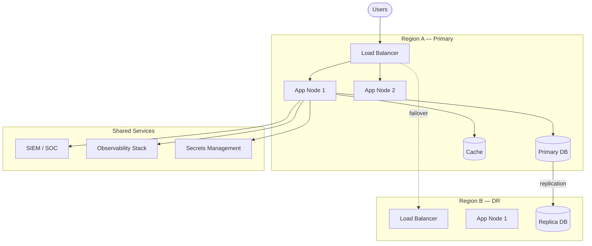

# Operational View

## Operational philosophy

A digital identity platform is critical national infrastructure. Operational concerns are as important as functional correctness. The platform is designed with the following operational principles:

- **Observable by default** — every service emits structured logs, metrics and traces from day one.
- **Runbook-driven** — all known failure modes have a documented runbook.
- **Immutable infrastructure** — servers and containers are replaced, not patched in place.
- **GitOps** — all infrastructure and configuration changes are version-controlled and reviewed.

---

## Deployment architecture

---

## Observability

### The three pillars

| Pillar | Tool (reference) | Key signals |
|---|---|---|
| Logs | Structured JSON, centralised (ELK / Loki) | Error rate, audit events, slow queries |
| Metrics | Prometheus + Grafana | Request rate, error rate, latency p50/p95/p99, DB pool saturation |
| Traces | OpenTelemetry + Jaeger / Tempo | End-to-end latency, bottlenecks, cross-service correlation |

### Key SLIs and SLOs

| SLI | SLO target |
|---|---|
| Identity verification API availability | ≥ 99.9 % per month |
| Identity verification API latency p95 | ≤ 300 ms |
| Enrollment submission success rate | ≥ 99.5 % |
| Audit log write success rate | 100 % (no data loss) |

---

## Incident management

### Severity levels

| Severity | Definition | Response time | Examples |
|---|---|---|---|
| P1 — Critical | Platform unavailable or data breach | Immediate, 24/7 | Total outage, security incident |
| P2 — High | Core feature degraded | < 30 min | Enrollment failing, verification slow |
| P3 — Medium | Non-critical degradation | < 4 h business hours | Reporting delayed, notifications slow |
| P4 — Low | Minor issue | Next sprint | UI glitch, non-critical warning |

### On-call and escalation

- Primary on-call: platform engineer.
- Escalation path: lead engineer → CTO → vendor support.
- Post-incident review (PIR) mandatory for P1 and P2 within 48 hours.

---

## Backup and recovery

| Component | Backup frequency | RPO | RTO |
|---|---|---|---|
| Primary database | Continuous WAL shipping + daily snapshot | < 5 min | < 30 min |
| Biometric vault | Daily encrypted snapshot | < 24 h | < 2 h |
| Audit log | Continuous replication to immutable store | 0 | Read-only during recovery |
| Application config | GitOps — version-controlled | 0 | < 15 min |

---

## Release and change management

- All changes go through pull request review + automated CI.
- Production deployments are gated by quality gates (tests, security scan, DORA metrics review).
- Blue/green or canary deployment for zero-downtime releases.
- Feature flags for gradual rollout of new identity flows.
- Change freeze windows around critical national events (elections, tax deadlines).

---

## Evolution path

- [ ] Define and publish SLO dashboard.
- [ ] Document runbooks for P1 / P2 scenarios.
- [ ] Automate DR failover test (quarterly game day).
- [ ] Add chaos engineering experiments for resilience validation.
