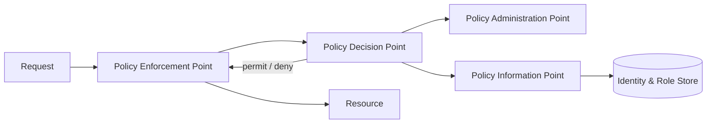
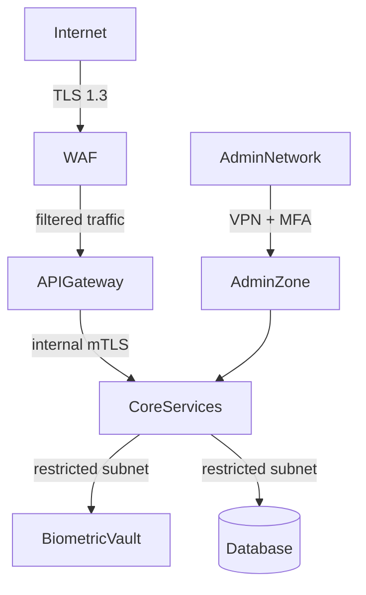

# Security Model

## Design principles

1. **Security by design** — security is a first-class architectural concern, not a retrofit.
2. **Least privilege** — every actor (human, service, process) receives only the permissions required for its stated function.
3. **Defence in depth** — multiple independent security controls; compromise of one layer does not result in full breach.
4. **Zero trust** — network location is not trusted; every request is authenticated and authorized.
5. **Fail secure** — on error or ambiguity, deny access rather than allow.
6. **Auditability** — all sensitive operations are logged and tamper-evident.

---

## Identity and access control

### Authentication

| Actor | Mechanism |
|---|---|
| Citizen (portal) | OIDC / OAuth 2.0 with MFA |
| Enrollment Operator | Smart card + PIN (PKI-based) |
| Service-to-service | mTLS + short-lived JWT |
| Admin | Privileged Access Workstation + MFA + session recording |

### Authorization model

Hybrid **RBAC + ABAC**:

- **RBAC** covers coarse-grained access: roles such as `EnrollmentOperator`, `Supervisor`, `AuditReader`, `SystemAdmin`.
- **ABAC** enforces fine-grained constraints: an operator can only access cases assigned to their regional office.

---

## Data protection

| Data category | Protection |
|---|---|
| Biometric templates | Encrypted at rest (AES-256), isolated vault, no raw export |
| Biographic PII | Encrypted at rest, field-level encryption for sensitive attributes |
| Audit logs | Signed entries (HMAC or asymmetric signature), immutable store |
| Document personalization data | Encrypted in transit (TLS 1.3), ephemeral in memory |
| API tokens | Short-lived (< 15 min), rotated, stored hashed |

**Key management:**

- Dedicated HSM or cloud KMS for key operations.
- Key rotation on a defined schedule.
- Separation between data encryption keys (DEK) and key encryption keys (KEK).

---

## Network security

- Public zone: WAF + API Gateway (rate limiting, bot protection, schema validation).
- Internal zone: mTLS between all services; no plaintext internal traffic.
- Biometric vault: network-isolated, access via dedicated internal API only.
- Admin zone: separate network segment, accessed via VPN and PAW.

---

## Threat model summary

| Threat | Mitigation |
|---|---|
| Identity fraud / impersonation | Biometric deduplication, document validation, liveness detection |
| Insider threat | RBAC + ABAC, dual-control for sensitive operations, audit log |
| Data breach | Encryption at rest and in transit, tokenisation, data minimisation |
| API abuse | Rate limiting, JWT validation, scope enforcement, anomaly detection |
| Denial of service | WAF, rate limiting, horizontal scaling, circuit breakers |
| Supply chain attack | Signed container images, dependency scanning, SBOM |

---

## Compliance alignment

- GDPR (or applicable data protection regulation): lawful basis, purpose limitation, data minimisation, right to erasure, breach notification.
- ISO/IEC 27001 controls for information security management.
- NIST SP 800-63 Digital Identity Guidelines for assurance levels.
- eIDAS 2.0 / ISO 18013-5 for cross-border and mobile identity scenarios.
